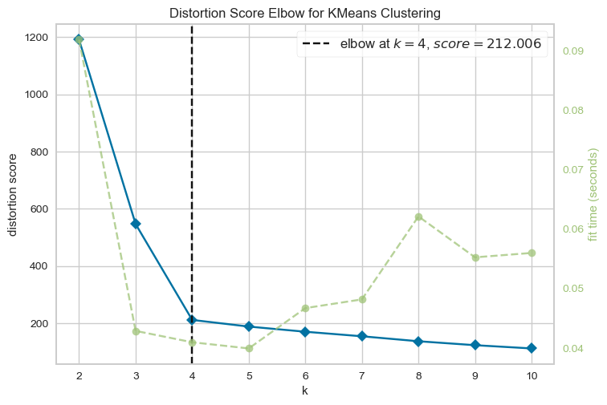
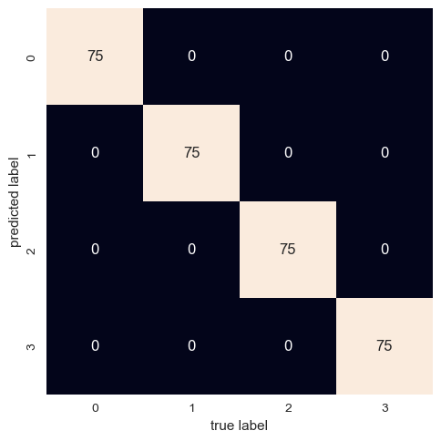

# Team Members
- Team Member 1: [Zachary Cervenka] - [cervenkaz19@students.ecu.edu]

## Quick Start

To use this code to draw a confusion matrix based off the optimal K value:

1. Clone or download this repository to your local machine.

2. Install the required Python libraries:

   ```bash
   pip install scikit-learn yellowbrick numpy seaborn matplotlib

3. Run each cell in this notebook sequentially.

4. Manually select the optimal K based on the generated elbow plot.

5. The notebook will print the confusion matrix for the best K value, allowing you to evaluate the clustering performance.

## Why K=4 Was Chosen as the Best K

In this project, we used the KElbowVisualizer to determine the optimal number of clusters (K) for our K-Means clustering task. The KElbowVisualizer helps us find the point on the "elbow" of the plot, indicating a balance between model complexity (number of clusters) and data variance explained.

The elbow method is a heuristic technique for finding the inflection point where adding more clusters does not significantly reduce the within-cluster sum of squares (WCSS). In other words, it helps us identify the K value at which additional clusters do not contribute substantially to improving our model's performance.

In our specific case:

- We generated an elbow plot using the KElbowVisualizer by varying K from 2 to 10, allowing us to visualize the trend of WCSS for different cluster numbers.

- Upon inspecting the plot, we observed that the rate of decrease in WCSS started to slow down considerably after K=4. 

- K=4 was the point at which the plot showed a distinct "elbow," indicating that adding more clusters would not significantly reduce WCSS and, thus, wouldn't improve our model's performance substantially.

Hence, based on the visual analysis of the elbow plot, we selected K=4 as the optimal number of clusters for our K-Means clustering task. This choice was made to strike a balance between capturing meaningful patterns in the data while avoiding overcomplication of the model with unnecessary clusters.



## Best k Accuracy
The accuracy score for the K-means clustering results is reported as 1.00 (100%). This high accuracy score signifies that, in the specific context of the dataset used and the selected parameters, our K-means clustering algorithm was able to perfectly assign data points to their true cluster labels.

**Key Points**:

**Synthetic Data**: It's important to note that this result was achieved using synthetic data generated with well-separated clusters.

**Optimal K**: The optimal number of clusters (K) was determined using the elbow method, ensuring that K-means was applied with an appropriate number of clusters for this specific data distribution.

**Ground Truth**: We had access to the true labels for this synthetic data, which allowed us to calculate the accuracy score. In practical, real-world scenarios, this level of perfect accuracy is less common due to the complexity and noise present in real data.

## Confusion Matrix for the Best K

Here is the confusion matrix for the best K value obtained from this notebook:



The confusion matrix shows how many data points from each true class were correctly assigned to each cluster. In this example, we have four clusters, and each cluster is ideally associated with a single class.


