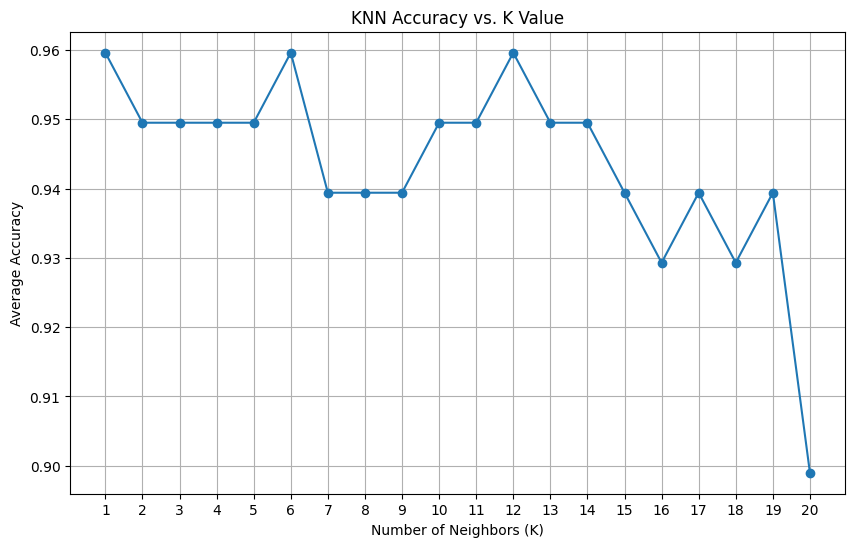

# Team Members
- Team Member 1: [Zachary Cervenka] - [cervenkaz19@students.ecu.edu]


# Quick Start
To run the code and reproduce the KNN analysis, follow these steps:

1. Ensure you have Python (>=3.5) installed on your system.
2. Install the required libraries using pip:

   ```bash
   pip install scikit-learn numpy matplotlib
3. Clone or download this repository.
4. Open the Jupyter notebook containing the provided code.
5. Execute the code in your preferred Python environment (e.g., Jupyter notebook).

# Analysis of the Best K Value
Based on the analysis of K values from 1 to 20, the best K value is determined to be {1} with an average accuracy of {0.9595959595959596}.

The choice of K depends on several factors, including the dataset's characteristics and the trade-off between bias and variance. It's important to consider model complexity and overfitting. In this case, K=1 appears to achieve the highest average accuracy, indicating that it provides a good balance between capturing the underlying patterns in the Iris dataset and avoiding overfitting.

# Line Chart
Below is the line chart illustrating how accuracy varies with different K values:
